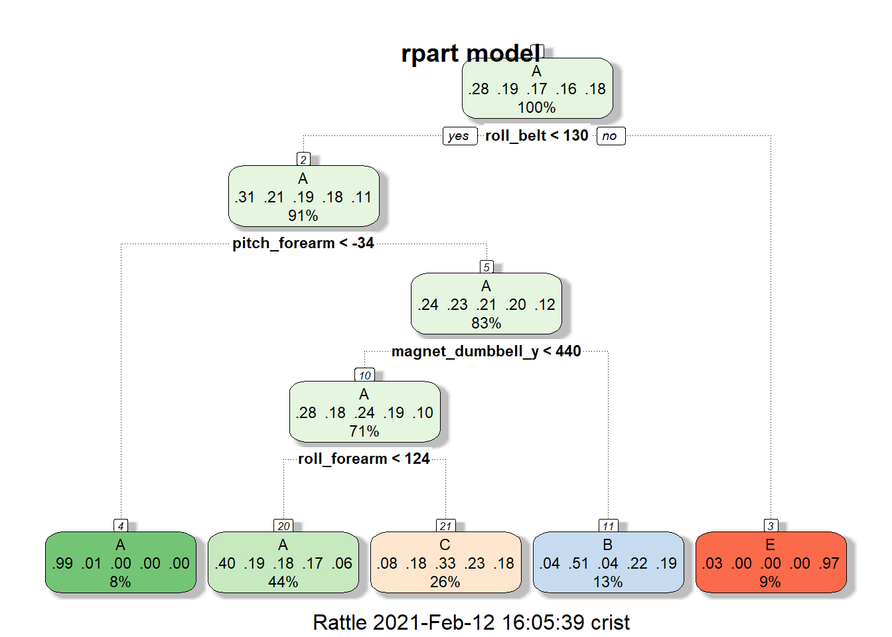

The data provided for this project include a large set of measurements taken during both correct and a variety of specifically incorrect demonstrations of weight-lifting exercises. The goal is to predict which demonstration class a specific weight-lifting event belongs to based on the measurements provided.

## Split Data


The data in this set is rather large, consisting in close to 20,000 rows, so it can easily be split into training, testing, and validation sets, using 60%, 20%, and 20% of the data, respectively. Our testing set is then set aside for final testing purposes, and the validation set is set aside for validation of potentially useful models. Here the row counts are indicated for each of the three sets. 


```r
## cell values that are "#DIV/0!" are loaded as na values
data<-read.csv("https://d396qusza40orc.cloudfront.net/predmachlearn/pml-training.csv",na.strings=c("#DIV/0!","","NA"))
set.seed(12015)
inTrain<-createDataPartition(y=data$classe,p=0.8,list=FALSE)
trainset<-data[inTrain,]
testing<-data[-inTrain,]
inTraining<-createDataPartition(y=trainset$classe,p=0.75,list=FALSE)
training<-trainset[inTraining,]
validation<-trainset[-inTraining,]
nrow(training)
```

```
## [1] 11776
```

```r
nrow(validation)
```

```
## [1] 3923
```

```r
nrow(testing)
```

```
## [1] 3923
```

## Pick Features

A first glance at the training set indicated that several of the columns had a large number of missing values. A count of these values showed that each variable either had more than 11,000 missing values or had no missing values. 


```r
na_count <-sapply(training, function(y) sum(length(which(is.na(y)))))
na_count <- data.frame(na_count)
hinas<-which(na_count>10000)
training<-training[,-hinas]
training<-training[,-c(1:7)]
```

With a total count of 11776 in this data set, this indicates that more than 98% of the cases in this set are missing a value for these particular variables, making said variables unfit to be relevant to our potential model. As a result, these 100 variables were removed from the training set. Additionally, the first seven columns of the set indicate specific information about the particular trial, indicating the user, the time stamp, the trial number, etc., none of which are data that should be considered as relevant prediction variables. These were also removed, reducing the training set from 159 to 52 potential predictor variables.

## Pick Prediction Function

The variable that we are trying to predict indicates one of five possible ways to either correctly or incorrectly perform a specific weightlifting exercise. Class A is the correct way to do the exercise and classes B, C, D, and E are specific incorrect ways to do it. As such, the prediction function is a classification task, and the most appropriate model is likely a tree. One model was created with the "rpart" method and a second model with the random forest ("rf") method.


```r
rpmod<-train(factor(classe)~.,data=training,method="rpart")
print(rpmod$finalModel)
```

```
## n= 11776 
## 
## node), split, n, loss, yval, (yprob)
##       * denotes terminal node
## 
##  1) root 11776 8428 A (0.28 0.19 0.17 0.16 0.18)  
##    2) roll_belt< 129.5 10712 7399 A (0.31 0.21 0.19 0.18 0.11)  
##      4) pitch_forearm< -33.95 930    6 A (0.99 0.0065 0 0 0) *
##      5) pitch_forearm>=-33.95 9782 7393 A (0.24 0.23 0.21 0.2 0.12)  
##       10) magnet_dumbbell_y< 439.5 8308 5971 A (0.28 0.18 0.24 0.19 0.1)  
##         20) roll_forearm< 123.5 5203 3118 A (0.4 0.19 0.18 0.17 0.057) *
##         21) roll_forearm>=123.5 3105 2071 C (0.081 0.18 0.33 0.23 0.18) *
##       11) magnet_dumbbell_y>=439.5 1474  722 B (0.035 0.51 0.043 0.22 0.19) *
##    3) roll_belt>=129.5 1064   35 E (0.033 0 0 0 0.97) *
```

```r
fancyRpartPlot(rpmod$finalModel,main="rpart model")
```

<!-- -->

```r
rfmod<-train(factor(classe)~.,data=training,method="rf",prox=TRUE)
rfmod
```

```
## Random Forest 
## 
## 11776 samples
##    52 predictor
##     5 classes: 'A', 'B', 'C', 'D', 'E' 
## 
## No pre-processing
## Resampling: Bootstrapped (25 reps) 
## Summary of sample sizes: 11776, 11776, 11776, 11776, 11776, 11776, ... 
## Resampling results across tuning parameters:
## 
##   mtry  Accuracy   Kappa    
##    2    0.9861581  0.9824765
##   27    0.9864264  0.9828172
##   52    0.9788936  0.9732800
## 
## Accuracy was used to select the optimal model using the largest value.
## The final value used for the model was mtry = 27.
```

```r
plot(rfmod, type="l", main="random forest model")
```

<!-- -->


## Apply to Validation and Refine

When the two models were applied to the validation set, the rpart model performed significantly worse than the random forest model, as seen in the confusion matrices below.


```r
## subset validation set the way the training set was done
validationset<-validation[,-hinas]
validationset<-validationset[,-c(1:7)]

## rpart model
rppred<-predict(rpmod,newdata=validationset)
confusionMatrix(rppred,factor(validationset$classe)) 
```

```
## Confusion Matrix and Statistics
## 
##           Reference
## Prediction   A   B   C   D   E
##          A 999 299 307 290  95
##          B  15 261  19 121  91
##          C  81 199 358 232 196
##          D   0   0   0   0   0
##          E  21   0   0   0 339
## 
## Overall Statistics
##                                           
##                Accuracy : 0.4989          
##                  95% CI : (0.4831, 0.5146)
##     No Information Rate : 0.2845          
##     P-Value [Acc > NIR] : < 2.2e-16       
##                                           
##                   Kappa : 0.3461          
##                                           
##  Mcnemar's Test P-Value : NA              
## 
## Statistics by Class:
## 
##                      Class: A Class: B Class: C Class: D Class: E
## Sensitivity            0.8952  0.34387  0.52339   0.0000  0.47018
## Specificity            0.6470  0.92225  0.78141   1.0000  0.99344
## Pos Pred Value         0.5020  0.51479  0.33583      NaN  0.94167
## Neg Pred Value         0.9395  0.85422  0.88589   0.8361  0.89279
## Prevalence             0.2845  0.19347  0.17436   0.1639  0.18379
## Detection Rate         0.2547  0.06653  0.09126   0.0000  0.08641
## Detection Prevalence   0.5073  0.12924  0.27173   0.0000  0.09177
## Balanced Accuracy      0.7711  0.63306  0.65240   0.5000  0.73181
```

```r
## random forest model
rfpred<-predict(rfmod,newdata=validationset)
confusionMatrix(rfpred,factor(validationset$classe))
```

```
## Confusion Matrix and Statistics
## 
##           Reference
## Prediction    A    B    C    D    E
##          A 1115    5    0    0    0
##          B    1  749    2    2    1
##          C    0    5  680   13    2
##          D    0    0    2  627    2
##          E    0    0    0    1  716
## 
## Overall Statistics
##                                           
##                Accuracy : 0.9908          
##                  95% CI : (0.9873, 0.9936)
##     No Information Rate : 0.2845          
##     P-Value [Acc > NIR] : < 2.2e-16       
##                                           
##                   Kappa : 0.9884          
##                                           
##  Mcnemar's Test P-Value : NA              
## 
## Statistics by Class:
## 
##                      Class: A Class: B Class: C Class: D Class: E
## Sensitivity            0.9991   0.9868   0.9942   0.9751   0.9931
## Specificity            0.9982   0.9981   0.9938   0.9988   0.9997
## Pos Pred Value         0.9955   0.9921   0.9714   0.9937   0.9986
## Neg Pred Value         0.9996   0.9968   0.9988   0.9951   0.9984
## Prevalence             0.2845   0.1935   0.1744   0.1639   0.1838
## Detection Rate         0.2842   0.1909   0.1733   0.1598   0.1825
## Detection Prevalence   0.2855   0.1925   0.1784   0.1608   0.1828
## Balanced Accuracy      0.9987   0.9925   0.9940   0.9869   0.9964
```

As a result, we selected the random forest model to use on our test set.

## Apply to Test Set


```r
testset<-testing[,-hinas]
testset<-testset[,-c(1:7)]
testpred<-predict(rfmod,newdata=testset)
confusionMatrix(testpred,factor(testset$classe))
```

```
## Confusion Matrix and Statistics
## 
##           Reference
## Prediction    A    B    C    D    E
##          A 1114    6    0    0    0
##          B    1  753    4    0    1
##          C    0    0  675    4    2
##          D    0    0    5  639    5
##          E    1    0    0    0  713
## 
## Overall Statistics
##                                          
##                Accuracy : 0.9926         
##                  95% CI : (0.9894, 0.995)
##     No Information Rate : 0.2845         
##     P-Value [Acc > NIR] : < 2.2e-16      
##                                          
##                   Kappa : 0.9906         
##                                          
##  Mcnemar's Test P-Value : NA             
## 
## Statistics by Class:
## 
##                      Class: A Class: B Class: C Class: D Class: E
## Sensitivity            0.9982   0.9921   0.9868   0.9938   0.9889
## Specificity            0.9979   0.9981   0.9981   0.9970   0.9997
## Pos Pred Value         0.9946   0.9921   0.9912   0.9846   0.9986
## Neg Pred Value         0.9993   0.9981   0.9972   0.9988   0.9975
## Prevalence             0.2845   0.1935   0.1744   0.1639   0.1838
## Detection Rate         0.2840   0.1919   0.1721   0.1629   0.1817
## Detection Prevalence   0.2855   0.1935   0.1736   0.1654   0.1820
## Balanced Accuracy      0.9980   0.9951   0.9925   0.9954   0.9943
```

The out-of-sample error rate is expected to be around 99%, since both the validation and test set error rates are slightly above 99%.
